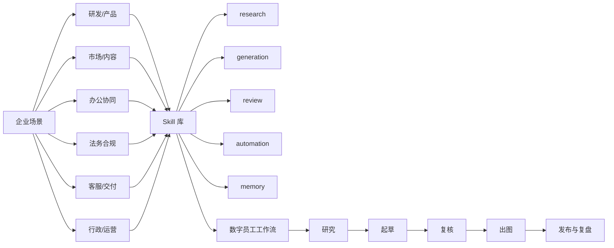

# README 顶图与结构图方向

## 这次建议解决什么

这个仓库现在最需要的，不是再加一层“AI 很强”的气氛图，而是让第一次打开 README 的人 10 秒内看懂三件事：

1. 这不是 Skill 大杂烩。
2. 它按企业场景在整理公开 Skill。
3. 它最终指向的是“数字员工怎么组合成工作流”。

基于当前仓库内容，首页首屏已经有足够支撑这个叙事：

- 6 个场景页：办公协同、法务合规、客服/交付、行政/运营、市场/内容、研发/产品
- 15 条已核公开 Skill
- 1 条数字员工工作流样板（内容运营链路）

## 推荐主方向

推荐把 README 顶部做成“知识地图型首图”，而不是海报型封面。

核心关系只讲一条：

企业场景 → 可用 Skill → 数字员工工作流

这样既能接住 taxonomy、skills.yaml、scenarios、workflows 四块内容，也方便后续扩充更多场景和流程，而不用每次重画逻辑。

## 首屏信息层级

### 一级信息：一句话说明仓库价值

建议主标题：

`Enterprise AI Skill Map`

建议副标题：

`把公开 Skill 整理成企业可用的数字员工知识库`

这一句比“企业级 AI 能力图谱”“智能体基础设施地图”更像人在说话，也更符合当前仓库真实内容。

### 二级信息：三段式关系

首图中只保留 3 个大模块：

- 企业场景
- Skill 库
- 数字员工工作流

建议配一条横向主路径：

`场景定问题 → Skill 定能力 → 工作流定交付`

### 三级信息：用少量样本证明不是空话

每个大模块只放 3-6 个代表项，不要把所有条目一次塞满。

建议示例：

- 企业场景：研发/产品、市场/内容、办公协同、法务合规、客服/交付、行政/运营
- Skill 库：coding、research、review、automation、memory
- 工作流：研究、起草、复核、出图、发布/复盘

## 视觉结构建议

## 方案 A｜知识地图型首图（推荐）

最适合 README 顶部，也最适合 GitHub 和移动端。

### 画面结构

横向 3 栏，中间用箭头或轻连接线串起来：

1. 左栏：企业场景
   - 用 6 个文件夹/卡片表示场景
   - 视觉上像“需求入口”
2. 中栏：Skill 库
   - 用标签、模块块、工具卡表示能力层
   - 不强调具体品牌 logo，避免看起来像工具广告墙
3. 右栏：数字员工工作流
   - 用 5 步流程表示交付链路
   - 强调“研究→起草→复核→交付”，而不是“全自动完成”

### 为什么推荐

- 能直接解释仓库结构
- 不依赖大段文字
- 后续 README、分享图、演示页都能复用同一套母版
- 对公开仓库更稳，不会像营销海报

### 视觉关键词

- enterprise editorial
- clean knowledge map
- light grid
- calm blue / teal / graphite
- card-based information architecture
- soft connector lines
- no logo wall
- no cyberpunk
- no fake dashboard overload

## 方案 B｜书架索引型首图

把仓库画成一个公开知识库书架：

- 左侧是场景分栏
- 中间是 Skill 卡片抽屉
- 右侧是工作流跑道

优点：像“知识库”
缺点：容易偏静态，流程感不如方案 A 清楚。

## 方案 C｜作战台型首图

把仓库画成一个运营/研究控制台：

- 左边是场景雷达
- 中间是 Skill 面板
- 右边是工作流泳道

优点：更有数字员工感
缺点：如果处理不好，容易太像平台宣传页，不够像公开知识库。

结论：

README 顶图优先用方案 A；方案 C 更适合后续对外介绍页或演示文稿。

## GitHub 可读的结构图建议

README 顶图下方，建议再补一个轻量结构图，不用再做复杂大图，直接用 Mermaid 或静态图都可以。

推荐关系如下：



如果担心移动端 Mermaid 太高，可以把它再压缩成 3 层关系图：

`企业场景 → Skill 库 → 数字员工工作流`

页面下翻后再分别展开 taxonomy、skills、scenarios、workflows。

## README 顶图文案建议

建议图内文字控制在这几组，不要再多：

- 主标题：`Enterprise AI Skill Map`
- 副标题：`把公开 Skill 整理成企业可用的数字员工知识库`
- 三个模块：`企业场景` / `Skill 库` / `数字员工工作流`
- 路径说明：`场景定问题 → Skill 定能力 → 工作流定交付`
- 底部证据条：`6 个场景页 · 15 条已核公开 Skill · 1 条工作流样板`

说明：

- “已核公开 Skill”比“精选 Skill”“优质 Skill”更克制，也更符合仓库定位。
- 不建议写“自治”“自动闭环”“一键落地”这类会把能力夸大的词。
- 不建议堆 GitHub 仓库名，首图里只讲结构，不讲明细。

## GPT Image 出图 Prompt（首图版）

下面这版 prompt 适合直接生成 README 顶图方向图，建议 16:9。

```text
Use case: infographic-diagram / editorial knowledge map
Asset type: landscape GitHub README hero image, single image
Canvas: 16:9, premium repository header visual, clear at desktop and mobile widths

Exact main title: "Enterprise AI Skill Map"
Exact subtitle: "把公开 Skill 整理成企业可用的数字员工知识库"
Exact short labels: "企业场景", "Skill 库", "数字员工工作流"
Exact process line: "场景定问题 → Skill 定能力 → 工作流定交付"
Exact evidence strip: "6 个场景页 · 15 条已核公开 Skill · 1 条工作流样板"

Content structure:
1. Left zone = enterprise scenarios shown as six clean category cards or folders:
   研发/产品, 市场/内容, 办公协同, 法务合规, 客服/交付, 行政/运营
2. Middle zone = skill library shown as modular tags/cards, grouped by capability:
   research, generation, review, automation, memory
3. Right zone = digital employee workflow shown as a five-step delivery lane:
   研究, 起草, 复核, 出图, 发布/复盘

Composition:
- Horizontal three-zone knowledge map
- Strong left-to-right flow from scenario cards to skill modules to workflow lane
- Large clean title area at top left or top center
- Thin connector lines and soft arrows
- Bottom has a restrained proof strip with the evidence line
- Keep plenty of whitespace and clear card grouping

Style:
Premium editorial enterprise knowledge-map style, calm blue-teal-graphite palette, soft light background, subtle grid, glass-card feel but restrained, modern repository visual, information architecture first, not a marketing poster, not a SaaS sales hero, not a noisy dashboard.

Constraints:
No company logos, no private names, no customer data, no QR code, no watermark, no fake screenshots, no cyberpunk neon, no robot faces, no exaggerated "full automation" vibe.
Keep the image readable on GitHub and mobile. Prioritize hierarchy and layout over decorative effects.
```

## 落地建议

如果后续要真替换 README 顶图，建议按下面顺序做：

1. 先出一张 2048×1152 的 GPT Image 首图
2. 用视觉 QA 检查中文是否可读、结构是否一眼懂
3. 再决定 README 下方是否补 Mermaid 结构图
4. 最后才改 README 文件本身

## 最终建议一句话

README 顶图不要做成“AI 很厉害”，要做成“这个仓库怎么把公开 Skill 变成企业能用的数字员工知识地图”。
